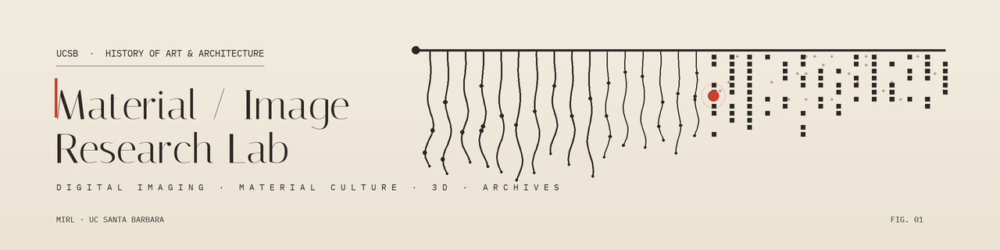

**The primary campus resource for image research and use at UC Santa Barbara.**

Exploring the dynamic interplay between digital images, emergent digital
technologies, and art objects.

[Lab Website](https://mirl.arthistory.ucsb.edu) ·
[Projects](https://mirl.arthistory.ucsb.edu/projects/) ·
[Contact](mailto:mirl@arthistory.ucsb.edu)

---

MIRL is a research lab in the **Department of the History of Art & Architecture**
at UC Santa Barbara. We study how analogue art objects and the built environment
can be imaged, preserved, and re-understood through emerging digital methods —
building open tools and treating images themselves as instruments of scholarship.

## Featured projects

### [California Native American Modern Art Archive](https://mirl.arthistory.ucsb.edu/cnamaa/)
A digital repository dedicated to documenting, preserving, and amplifying the
work of modern and contemporary Native American artists from California — long
underrepresented in major art-historical platforms. Built on a post-custodial,
consent-driven model where artists retain control over how their work is
represented, following Indigenous Data Sovereignty principles. Both a repository
and a pedagogical initiative training students in ethical archival methods.

### [mirl-3d-analyzer](https://github.com/mirl-ucsb/mirl-3d-analyzer)
Tools for new three-dimensional ways of seeing objects. Part of our **Ways of
Seeing** work, where computational imaging turns 3D models into analytical
instruments for studying an object's form, surface, and structure.

### [rescue-archiving](https://github.com/mirl-ucsb/rescue-archiving)
A local-first, human-in-the-loop pipeline for preserving at-risk media with
verifiable provenance. A response to media disappearing from conflict zones: it
makes tamper-evident copies, secures independent dated backups, records a full
chain of custody, and is built to protect the people who provide material.

### [mirl-map](https://github.com/mirl-ucsb/mirl-map)
A no-build documentary photo-map pairing geolocated photographs with per-photo narratives, shown as an interactive Leaflet map and a sequential photo essay. Generalised from MIRL's Lifta project; fork it per project. Plain HTML, CSS, and vanilla JS, deploys free on GitHub Pages. In development.

### [Haptic Khipu](https://khipu.mirl.arthistory.ucsb.edu)
A digital exploration of Andean recordkeeping systems. We investigate a
16th-century khipu — a knotted-cord recording device — held at UCSB's Art,
Design & Architecture Museum through material, haptic, and digital imaging
methods, exploring how knowledge is encoded in fiber and form. The site offers
interactive stories, a collection of featured cords, and a glossary.
[khipu.mirl.arthistory.ucsb.edu](https://khipu.mirl.arthistory.ucsb.edu)

## Get involved

We're a collaborative space for UCSB faculty, researchers, and students, offering imaging and
digitization support for both 2D and 3D objects.

- Arts Building, Room 1245 · Mon–Thu, 8am–4pm
- Internships: Dr Jeff O'Brien ([jeffobrien@ucsb.edu](mailto:jeffobrien@ucsb.edu))
- Room & equipment booking: Christine Fritsch ([cfritsch@ucsb.edu](mailto:cfritsch@ucsb.edu))
- General: [mirl@arthistory.ucsb.edu](mailto:mirl@arthistory.ucsb.edu)
